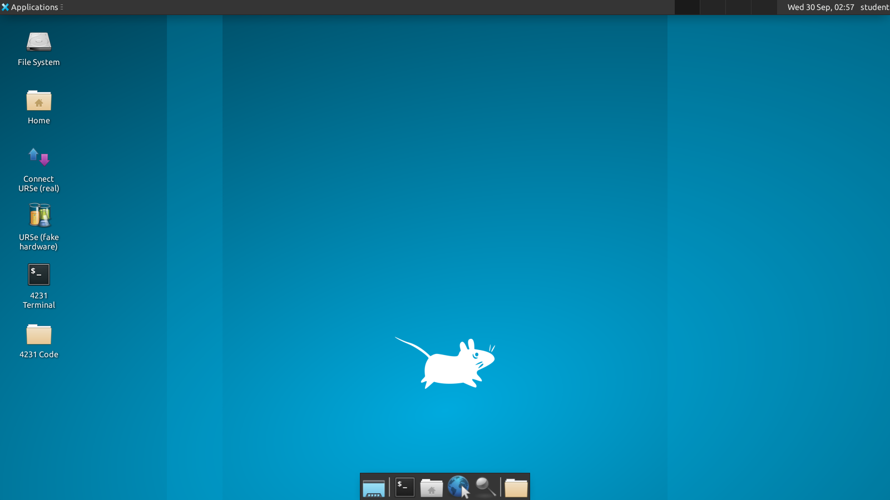
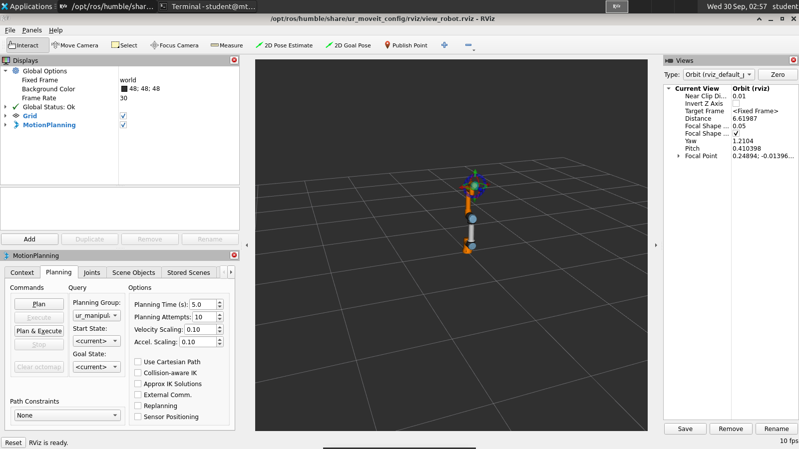
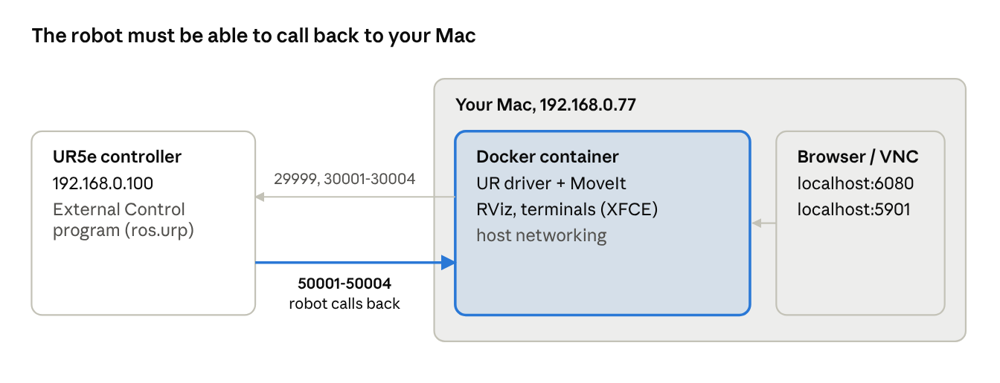

# MTRN4231 Setup Guide (Docker)

One Docker container gives you the full MTRN4231 environment on a Mac or a Linux PC, and it can drive the lab UR5e.
It follows the course Install Guide (Ubuntu 22.04 + ROS 2 Humble desktop), with the UR driver and MoveIt 2 installed from apt instead of built from source.

- **What you get:** ROS 2 Humble desktop, rqt, RViz, colcon, the Universal Robots driver + MoveIt 2 (`ros-humble-ur`), RealSense and USB camera drivers, `xacro` and `joint_state_publisher_gui`, and OpenCV.
- **A full Linux desktop in your browser:** terminals, RViz and rqt all run in one desktop window. No X server or VM is needed on the Mac.
- **Your code stays on your computer:** the repository is bind-mounted at `~/4231` in the container. Edits and `colcon build` output live in your clone and survive container rebuilds.
- **Not included:**
  - YOLO/ultralytics: pip-install it in Lab 4, as the sheet says.
  - The Arduino IDE and VS Code: install these on your own computer.

Last tested 2026-09-30 with an Apple Silicon MacBook (Docker Desktop 4.74) and a lab UR5e on PolyScope 5.10.2.
MoveIt planned and executed trajectories on the real arm from the container.

**Contents:**
[Prerequisites](#prerequisites) ·
[First-time setup](#first-time-setup) ·
[Using the desktop](#using-the-desktop) ·
[Connecting to the UR5e](#connecting-to-the-ur5e) ·
[Practising without the robot](#practising-without-the-robot) ·
[Troubleshooting](#troubleshooting) ·
[Reference](#reference)

---

## Prerequisites

You need Docker, about 10 GB of free disk space, and roughly 30 minutes for the first image build on a typical uni connection.

| | macOS (Intel or Apple Silicon) | Linux (Ubuntu lab PC) |
| --- | --- | --- |
| Docker | [Docker Desktop](https://www.docker.com/products/docker-desktop/) 4.34 or newer | Docker Engine + the compose plugin |
| One-off setting | Docker Desktop → *Settings → Resources → Network* → **Enable host networking**, then restart Docker Desktop | None |
| Memory for Docker | 8 GB or more (*Settings → Resources*) | No limit |
| Robot cable | A USB or Thunderbolt Ethernet adapter | The PC's Ethernet port |
| Cameras / Arduino | Not possible: Docker Desktop can't pass USB devices through | Supported |

Windows isn't supported yet.

## First-time setup

Four commands take you from nothing to a working desktop. Only the image build is slow, and it happens once.

1. Clone the repository:
    ```bash
    git clone https://github.com/jadegav10/MTRN4231.git ~/4231
    cd ~/4231/setup
    ```
2. Build the image and start the container:
    ```bash
    ./4231.sh up
    ```
    The first run creates your settings file, `setup/.env`. It then downloads about 700 MB of ROS packages, which takes 15–30 minutes.
3. Build the course's shared packages (`packages/4231_utils`, `packages/4231_demo_packages`). This takes about a minute:
    ```bash
    ./4231.sh build
    ```
4. Open the desktop (Mac):
    ```bash
    ./4231.sh desktop
    ```

Edit `setup/.env` when you need to change a setting, then run `./4231.sh up` again to apply it:

| Setting | Set it to |
| --- | --- |
| `ROBOT_IP` | The UR5e controller's IP. The lab arm is `192.168.0.100` |
| `HOST_IP` | **Mac only, for the real robot:** your computer's IP on the robot cable, e.g. `192.168.0.77`. Leave empty on Linux |
| `ROS_DOMAIN_ID` | A number unique to your bench (0–101), so benches don't see each other's topics |
| `VNC_PASSWORD` | Any password, if you want to use a native VNC client. Leave empty for the browser only |
| `HOST_UID` / `HOST_GID` | **Linux only:** filled in for you from `id -u` / `id -g` |

`./4231.sh` detects your OS and picks the right configuration (`mac-host` on a Mac, `linux` on Linux).
The container keeps running in the background, and it restarts with Docker unless you run `./4231.sh stop`.

To get course updates later: `cd ~/4231 && git pull`.
Keep your own work in `labs/` or in your own packages, so pulls don't conflict.
If you want your own backup, push to a **private** repo of your own.
Don't use a public fork: it would publish your lab solutions.

## Using the desktop

On a Mac, everything happens in a full Linux (XFCE) desktop that runs inside the container.
You open it in your browser or with a VNC client.

- **Browser:** go to <http://localhost:6080/vnc.html?autoconnect=1&resize=remote>, or run `./4231.sh desktop`. The desktop resizes to fit the window.
- **Native VNC client (smoother):** in Finder, choose *Go → Connect to Server* and enter `vnc://localhost:5901`. Use the `VNC_PASSWORD` from your `.env`.
- **Only on your computer:** both addresses listen on localhost, so nobody else on the uni network can reach your desktop.



| Desktop icon | What it does |
| --- | --- |
| 4231 Terminal | Opens a terminal in `~/4231` with ROS 2 already sourced. Open as many as you need |
| Connect UR5e (real) | Starts the UR driver + MoveIt + RViz for the physical arm ([next section](#connecting-to-the-ur5e)) |
| UR5e (fake hardware) | The same, with a simulated arm, for practising without the robot |
| 4231 Code | Opens the repository in the file manager |

RViz, rqt and every other GUI open as windows on this desktop.
RViz renders in software, at about 10 fps on an M-series Mac, which is fine for planning.



You can also skip the desktop terminal: `./4231.sh shell` opens a container shell in your Mac's own Terminal.
Any GUI you start from it still appears on the desktop.

On **Linux**, there's no separate desktop: GUI windows open directly on your normal screen.

## Connecting to the UR5e

Start the driver first, then press Play on the pendant.
The pendant program connects back to your computer only once, so the order matters.

The driver works in both directions:
- Your computer connects to the robot on ports 29999 and 30001–30004.
- The robot's External Control program then connects back to your computer on ports 50001–50004.



The callback (highlighted) is what fails when the pendant times out.
It needs host networking on a Mac, and both `HOST_IP` and the URCap Host IP set to your Mac's address.

**1. Network, done once per computer**

- **Mac:** plug the Ethernet adapter into the robot. In *System Settings → Network → (the adapter) → Details → TCP/IP*, choose *Manually*: IP `192.168.0.77` (any unused `192.168.0.x`), subnet `255.255.255.0`, no router. Put the same IP in `HOST_IP` in `setup/.env`, then run `./4231.sh up`.
- **Linux:** give the Ethernet port a static IP on `192.168.0.x/24`. Leave `HOST_IP` empty.
- Check the link with `ping 192.168.0.100`.
- Turn off any VPN (NordVPN etc.).

**2. On the pendant, done once per robot:** in *Installation → URCaps → External Control*, set **Host IP** to your computer's IP (e.g. `192.168.0.77`), and leave the port at `50002`.
The lab program `ros.urp` contains the External Control node.

**3. Each session**

1. Power the arm on and release the brakes. The arm must be in Normal mode.
2. On the desktop, double-click **Connect UR5e (real)**, or run `./4231.sh real` in your Mac terminal. The driver and MoveIt start, and RViz opens.
3. On the pendant, **Stop**, then **Play** `ros.urp`.
4. The driver terminal should print, in order:
    ```
    Robot requested program
    Sent program to robot
    Robot connected to reverse interface. Ready to receive control commands.
    ```
5. In RViz, drag the goal marker, then click **Plan**. Check the preview, then click **Execute**.

> **Safety.** Keep a hand near the e-stop whenever you press Execute. Start with the default 10% velocity scaling.
> Pressing Stop on the pendant cuts ROS control immediately. The driver then refuses new motion until you press Play again.

The driver and MoveIt run in a tmux session named `ur5e`, one tmux window each.
- Press `Ctrl-b n` to switch windows.
- Closing the terminal only detaches: everything keeps running, and `tmux attach -t ur5e` brings it back.
- To stop both, run `tmux kill-session -t ur5e` in any container terminal.

## Practising without the robot

The fake-hardware mode runs the same driver, MoveIt and RViz against a simulated UR5e.
You can plan and execute with no arm or cable attached.

- On the desktop, double-click **UR5e (fake hardware)**, or run `./4231.sh fake`.
- Plan and Execute behave as they do on the real robot: the RViz model moves and `/joint_states` updates.
- Run your lab nodes against it before booking time on the real arm. They can't tell the difference.

This replaces `scripts/setupFakeur5e.sh`, which opens `gnome-terminal` windows that don't exist in the container.

## Troubleshooting

Most connection problems are one of two things: the pendant program started before the driver, or the Mac isn't using host networking.

| Symptom | Cause | Fix |
| --- | --- | --- |
| Pendant: *"connection to the remote PC at …:50002 could not be established … timed out"* | The program was played before the driver was running, or `Host IP` in the URCap is wrong | Start the driver, then Stop and Play on the pendant. Check that `Host IP` is your computer's IP |
| Driver prints `Stream is connected but failed to read from it` over and over, and joint states stop | Mac running the old `mac` (port-forwarding) service | Enable host networking in Docker Desktop, then run `./4231.sh down` followed by `./4231.sh up` |
| `Connection to reverse interface dropped` right after it connected | Pendant program stopped or paused | Press Play again |
| RViz: *Execute* does nothing, driver says `Controller is not running` | Pendant program isn't playing | Press Play on the pendant, wait for `Robot connected to reverse interface`, then retry |
| Driver: `calibration parameters … don't match` | The robot's factory calibration hasn't been extracted | Safe to ignore for labs (poses can be a few mm off). To fix it, see `ur_calibration` in [DOCKER_DETAILS.md](DOCKER_DETAILS.md) |
| Can't ping `192.168.0.100` | Adapter IP not set, cable in the wrong port, or a VPN is on | Recheck the manual IP, turn off VPNs, try another cable |
| Other benches' topics appear in `ros2 topic list` | Same `ROS_DOMAIN_ID` on a shared network | Give each bench its own `ROS_DOMAIN_ID` in `setup/.env`, then run `./4231.sh up` |
| RealSense, webcam or Arduino not found (Mac) | Docker Desktop can't pass USB devices through | Use a Linux lab PC, or record a rosbag there and replay it on the Mac |
| Linux: `cannot open display` | Host X server refuses the container | Run `xhost +local:` (`./4231.sh` does this for you) |
| `./4231.sh: Permission denied` | Clone lost the executable bit | Run `chmod +x setup/4231.sh setup/scripts/*.sh` |

## Reference

Run every command from the `setup` folder.
`./4231.sh` wraps `docker compose` and picks the right service for your OS.

| Command | What it does |
| --- | --- |
| `./4231.sh up` | Builds the image the first time, then starts or updates the container |
| `./4231.sh shell` | Opens a container terminal in your own terminal app |
| `./4231.sh desktop` | Opens the browser desktop |
| `./4231.sh build` | Builds `packages/4231_utils` and `packages/4231_demo_packages` |
| `./4231.sh fake` | Fake UR5e + MoveIt + RViz |
| `./4231.sh real [IP]` | Real UR5e + MoveIt + RViz (default `192.168.0.100`) |
| `./4231.sh stop` / `down` | Stops the container / removes it (your code is untouched) |
| `./4231.sh rebuild` | Rebuilds the image after a Dockerfile change |

| File in `setup/` | Purpose |
| --- | --- |
| `Dockerfile` | The image: Ubuntu 22.04, ROS 2 Humble desktop, `ros-humble-ur`, XFCE desktop, noVNC |
| `compose.yaml` | Services `mac-host` (Mac, default), `linux` (lab PCs) and `mac` (fallback) |
| `.env` | Your settings (created from `.env.example`, not committed) |
| `entrypoint.sh` | Starts the virtual desktop |
| `scripts/` | `build_4231.sh`, `ur5e_real.sh`, `ur5e_fake.sh`: on the PATH in the container |
| `desktop/` | Desktop icons and XFCE settings |
| `DOCKER_DETAILS.md` | Technical details for maintainers |

**Differences from the lab machines**

- **UR driver and MoveIt come from apt.** The container uses `ros-humble-ur` 2.14; the course's source copy in `source/` is 2.2.8. They behave the same for the labs, but the course copy adds a `test_configuration` goal state that Lab 3 asks for. In RViz, pick `home` or `up` instead, or drag the arm.
- **`pip install --user` is kept** in a Docker volume. Other pip installs are lost when the container is recreated.
- **Keep `numpy` below 2** (`pip install --user "numpy<2"`), or `cv_bridge` stops working. Lab 4's `pip install -r requirements.txt` may try to upgrade it.
